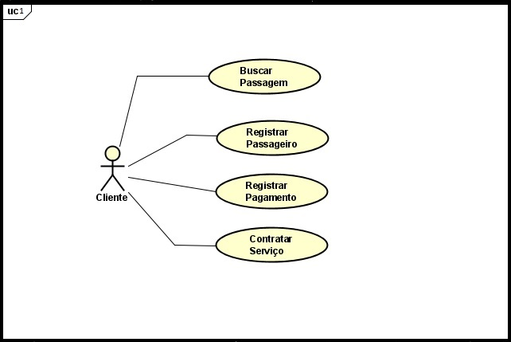
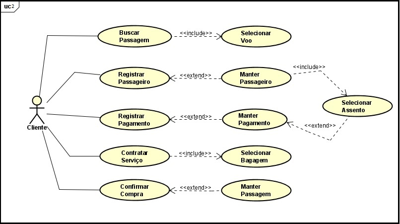
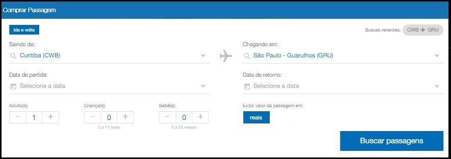

# AirlineReservationSystem

## Sistema de Reservas Aéreas Java
Este projeto exemplar abrange todo o processo de busca, escolha e
compra de passagens aéreas. A documentação UML proporciona uma
modelagem abrangente desse processo, oferecendo uma visão completa
e estruturada das etapas envolvidas na busca, seleção e aquisição
de passagens.

## 1. História do Cliente
Uma empresa aérea deseja vender uma passagem aérea de ida e
volta para um determinado destino para um cliente, onde o
cliente precisa informar local de origem e destino, quantos 
passageiros, quantas bagagens pretende levar e selecionar a
melhor forma de pagamento dentre as disponíveis.

## 2. Lista de Requisitos
| Número |      Lista de Requisitos       |           Descrição                       |
|--------|------------------------------- |-------------------------------------------|
| R1     | Buscar uma passagem aérea      | O cliente busca passagem aérea            |
| R2     | Registrar passageiro           | O cliente cadastra os passageiros         |
| R3     | Contratar serviço              | O cliente informa a quantidade de bagagem |
| R4     | Registrar pagamento            | O cliente informa a forma de pagamento    |

## 3. Diagrama de Caso de Uso
  ### a. Caso de uso nível 01
  
  
  ### b. Caso de uso nível 02
  

## 4. Histórias de Usuário
  ### HU001 – Buscar Passagem
  
  | Sendo            | Quero                      | Para                                  |
|------------------|----------------------------|---------------------------------------|
| Um cliente      | Comprar uma passagem aérea  | Viajar de uma origem para um destino |

#### Desenho da(s) Tela(s)
 
