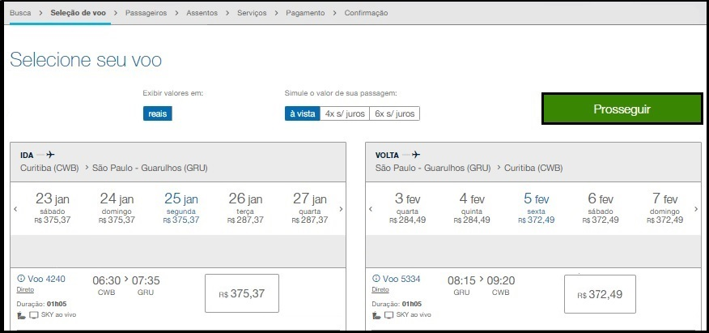
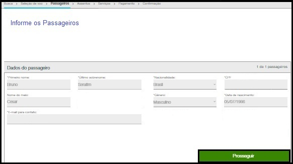

# AirlineReservationSystem

## Sistema de Reservas Aéreas Java
Este projeto exemplar abrange todo o processo de busca, escolha e
compra de passagens aéreas. A documentação UML proporciona uma
modelagem abrangente desse processo, oferecendo uma visão completa
e estruturada das etapas envolvidas na busca, seleção e aquisição
de passagens.

## 1. História do Cliente
Uma empresa aérea deseja vender uma passagem aérea de ida e
volta para um determinado destino para um cliente, onde o
cliente precisa informar local de origem e destino, quantos 
passageiros, quantas bagagens pretende levar e selecionar a
melhor forma de pagamento dentre as disponíveis.

## 2. Lista de Requisitos
| Número |      Lista de Requisitos       |           Descrição                       |
|--------|------------------------------- |-------------------------------------------|
| R1     | Buscar uma passagem aérea      | O cliente busca passagem aérea            |
| R2     | Registrar passageiro           | O cliente cadastra os passageiros         |
| R3     | Contratar serviço              | O cliente informa a quantidade de bagagem |
| R4     | Registrar pagamento            | O cliente informa a forma de pagamento    |

## 3. Diagrama de Caso de Uso
  ### a. Caso de uso nível 01
  
  
  ### b. Caso de uso nível 02
  

## 4. Histórias de Usuário

### HU001 – Buscar Passagem
  
  | Sendo            | Quero                      | Para                                  |
|------------------|----------------------------|---------------------------------------|
| Um cliente      | Comprar uma passagem aérea  | Viajar de uma origem para um destino |

  #### Desenho da Tela
 
 
  #### Critérios de aceitação:
  ####  1. Deve apresentar “saindo de” ao ingressar na tela
  ####  2. Deve apresentar “chegando em” ao ingressar na tela
  ####  3. Deve apresentar “data de partida” ao ingressar na tela
  ####  4. Deve apresentar “data de retorno” ao ingressar na tela
  ####  5. Deve apresentar “adultos” ao ingressar na tela
  ####  6. Deve apresentar “crianças” ao ingressar na tela
  ####  7. Deve apresentar “bebes” ao ingressar na tela
  ####  8. Não deve prosseguir sem que todos os campos estejam selecionados
  ####  9. Deve Buscar a passagem

  ### HU002 – Selecionar Voo  
   | Sendo            | Quero                      | Para                               |
|------------------|----------------------------|---------------------------------------|
| Um cliente      | selecionar o voo disponível  | viajar de uma origem para um destino |

#### Desenho da Tela

#### Critérios de aceitação:
####  1. Deve apresentar horários disponível de voos de ida ao ingressar na tela
####  2. Deve apresentar horários disponível de voos de volta ao ingressar na tela 
####  3. Deve apresentar valores em reais ao ingressar na tela
####  4. Deve apresentar simulação de valor da passagem
####  5. Não deve prosseguir sem que todos os campos estejam selecionados
####  6. Deve registra passagem selecionada

### HU003 – Registrar Passageiro
| Sendo            | Quero                      | Para                               |
|------------------|----------------------------|---------------------------------------|
| Um cliente      | preencher os dados dos passageiros  | viajar de uma origem para um destino |

#### Desenho da Tela

#### Critérios de aceitação:
####  1. Deve apresentar a quantidade de passageiro selecionado ao ingressar na tela
####  2. Deve apresentar as nacionalidades disponíveis ao ingressar na tela
####  3. Deve apresentar os gêneros disponíveis ao ingressar na tela
####  4. Não deve prosseguir com campos inconsistentes
####  5. Não deve prosseguir sem que todos os campos estejam preenchidos
####  6. Deve registrar os passageiros

### HU004 – Selecionar Assento
| Sendo            | Quero                      | Para                               |
|------------------|----------------------------|---------------------------------------|
| Um cliente      | selecionar um assento na aeronave | viajar de uma origem para um destino |

#### Desenho da Tela

