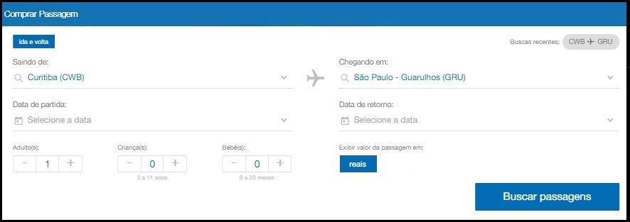
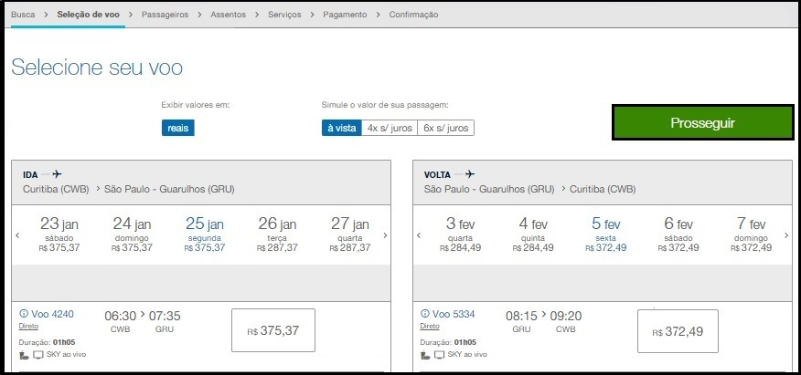
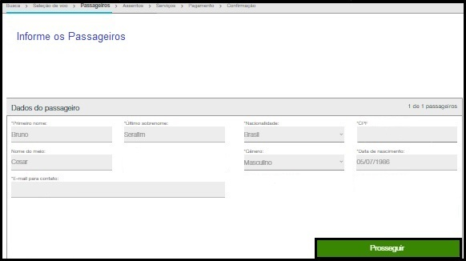
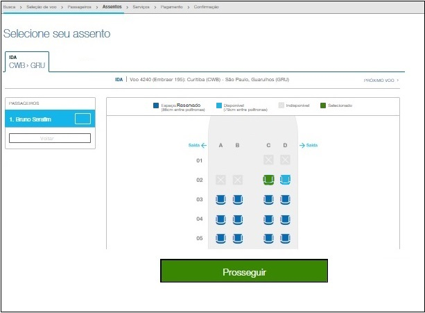
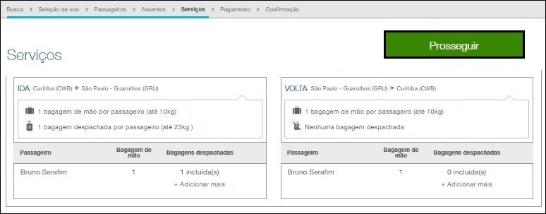
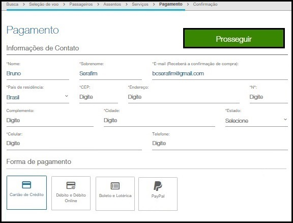
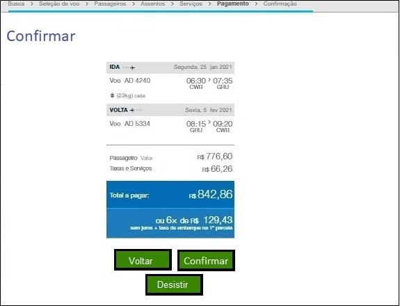
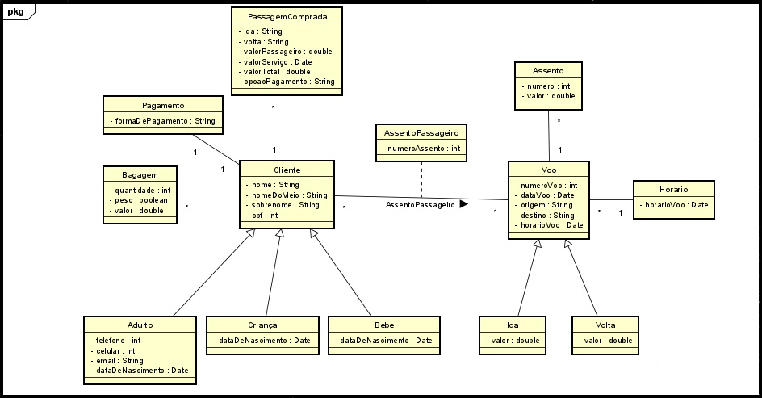
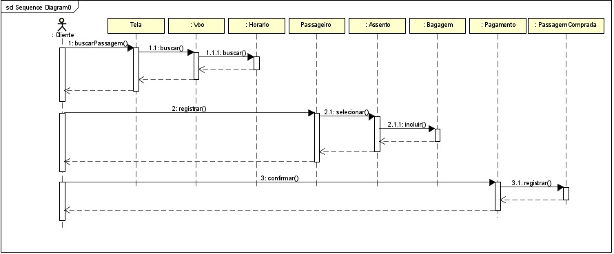

# AirlineReservationSystem

## Java Air Reservation System
This exemplary project covers the entire process of searching, choosing, and
purchasing airline tickets. The UML documentation provides comprehensive modeling
of this process, offering a complete and structured view of the steps involved in
searching, selecting, and acquiring tickets.

## 1. Customer Story
An airline company aims to sell a round-trip airline ticket to a specific destination for a
customer. The customer needs to provide the place of departure and destination, the
number of passengers, the amount of luggage they intend to carry, and select the best
available payment method.

## 2. Requirements List
| Number |      Requirements List         |              Description                       |
|--------|------------------------------- |------------------------------------------------|
| R1     | 	Search for an Airline Ticket  | The customer searches for an airline ticket.   |
| R2     | Register Passenger             | The customer registers the passengers.         |
| R3     | Hire Service                   | The customer informs the quantity of luggage   |
| R4     | Register Payment               | The customer informs the payment method.       |

## 3. Use Case Diagram
  ### a. Use Case Level 01
  
  
  ### b. Use Case Level 02
  

## 4. User Stories

### HU001 – Search for Flights
  
  | User           | Want                       | So that                               |
|------------------|----------------------------|---------------------------------------|
| A customer      | To purchase an airline ticket  | Travel from one location to another |

  #### Screen Design
 
 
  #### Acceptance Criteria:
  ####  1. Should display "departing from" when entering the screen
  ####  2. Should display "arriving at" when entering the screen
  ####  3. Should display "departure date" when entering the screen
  ####  4. Should display "return date" when entering the screen
  ####  5. Should display "adults" when entering the screen
  ####  6. Should display "children" when entering the screen
  ####  7. Should display "infants" when entering the screen
  ####  8. Must not proceed unless all fields are selected
  ####  9. Should search for the flight

  ### HU002 – Select Flight  
|  User             | Want                      | So that                             |
|-------------------|---------------------------|-------------------------------------|
| A customer        | Select available flight   | Travel from one location to another |

#### Screen Design

#### Acceptance Criteria:
####  1. Should display available departure flight times when entering the screen
####  2. Should display available return flight times when entering the screen 
####  3. Should display values in Brazilian Reais when entering the screen
####  4. Should simulate the ticket value
####  5. Should not proceed unless all fields are selected
####  6. Should register the selected ticket

### HU003 – Register Passenger
| User            | Want                       | So that                               |
|-----------------|----------------------------|---------------------------------------|
| A customer      | Fill in Passenger Details  | Travel from one location to another   |

#### Screen Design

#### Acceptance Criteria:
####  1. Should display the selected number of passengers when entering the screen
####  2. Should display available nationalities when entering the screen
####  3. Should display available genders when entering the screen
####  4. Should not proceed with inconsistent fields
####  5. Should not proceed without all fields filled out
####  6. Should register passengers

### HU004 – Select Seat
| User          | Want                          | So that                               |
|---------------|-------------------------------|---------------------------------------|
| A customer    | Select a seat on the aircraft | Travel from one location to another   |

#### Screen Design

#### Acceptance Criteria:
####  1. It must display the departure and destination information upon entering the screen
####  2. It must display the flight number and details upon entering the screen
####  3. It must display the registered passengers upon entering the screen
####  4. It must display the seats of the flight with their status upon entering the screen
####  5. It should not proceed without selecting an item
####  6. It must record the selected seats

### HU005 – Hire Service
| User            | Want                       | So that                              |
|-----------------|----------------------------|--------------------------------------|
| A customer      | Check Baggage              | Travel from one location to another  |

#### Screen Design

####  Acceptance Criteria:
####  1. Must show departure and destination data upon entering the screen
####  2. Must show return departure and destination data upon entering the screen
####  3. Must show baggage rules upon entering the screen
####  4. Must show registered passengers upon entering the screen
####  5. Must show carry-on baggage upon entering the screen
####  6. Must show checked baggage upon entering the screen
####  7. Must register inserted baggage

### HU006 – Register Payment
| User            | Want                            | So that                                   |
|------------------|---------------------------------|---------------------------------------|
| A customer       | Select Payment Method | Travel from one location to another  |

#### Screen Design

####  Acceptance Criteria:
####  1. Must present country of residence when entering the screen
####  2. Must present ZIP code when entering the screen
####  3. Must present available payment methods when entering the screen
####  4. Should not proceed with inconsistency
####  5. Should not proceed without filled and selected fields
####  6. Must register the payment method

### HU007 – Confirm
| User            | Want                      | So that                               |
|-----------------|---------------------------|---------------------------------------|
| A customer      | Finalize ticket purchase  | Travel from one location to another   |

#### Screen Design

####  Acceptance Criteria:
####  1. Should display one-way flight details upon entering the screen
####  2. Should display return flight details upon entering the screen
####  3. Should display the ticket prices for passengers upon entering the screen
####  4. Should display the service fee upon entering the screen
####  5. Should display the total amount to be paid upon entering the screen
####  6. Should display payment options upon entering the screen
####  7. Should finalize the purchasea
####  8. Should go back to the previous screen
####  9. Should cancel the purchase

## 5. Class Diagram

## 6. Sequence Diagram

